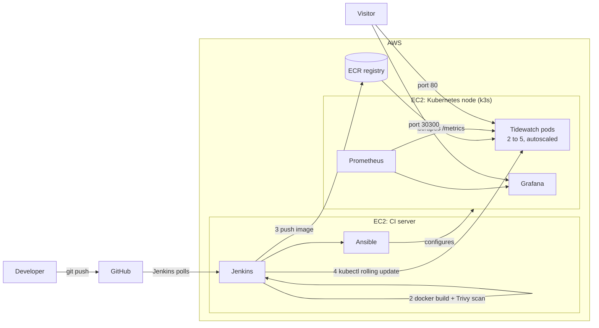

# Tidewatch: a Kubernetes platform on AWS

Tidewatch is a small website that shows **which Kubernetes pod answered your request**, and lets
you add load to watch the cluster react. Around it sits a complete platform:

- **Terraform** creates the AWS infrastructure
- **Ansible** configures the servers and installs Kubernetes
- **Jenkins** tests, builds, scans and deploys every change pushed to GitHub
- **Kubernetes (k3s)** runs the app with health checks, rolling updates and autoscaling
- **Prometheus and Grafana** show what is happening, with dashboards and alert rules

The whole platform is rebuilt from scratch with one `terraform apply` and removed with one
`terraform destroy`.

## Architecture



## What each tool does

| Tool | Role in this project |
|---|---|
| **AWS** | EC2 servers, ECR image registry, IAM roles, security groups |
| **Terraform** | Creates all AWS resources and the SSH key; one command up, one command down |
| **Ansible** | Installs k3s, node exporter, Prometheus and Grafana, and gives Jenkins access to the cluster |
| **Git and GitHub** | Source of truth for the app, the infrastructure, the manifests and the dashboards |
| **Jenkins** | Pipeline: lint, test, build, scan, push, deploy, verify, rollback |
| **Docker** | Packages the app as an image (non-root user, health check) |
| **Kubernetes (k3s)** | Deployment, Service, Ingress, probes, rolling updates, autoscaler, disruption budget |
| **Prometheus** | Collects metrics from the app, the containers and both servers; evaluates alert rules |
| **Grafana** | A provisioned dashboard with 12 panels |

## The website

Tidewatch is built to make Kubernetes visible:

- **Answered by**: the name of the pod that served this page, its node, and its uptime
- **Pods answering**: a tile per pod. Refresh or add load and watch requests spread across pods,
  and new tiles appear when the autoscaler adds pods
- **Load lab**: sliders for parallel requests and CPU time per request, live requests per second,
  latency and a latency graph
- **How this page got here**: the real build number, commit and build time, stamped into the
  image by Jenkins

The app exposes `/health`, `/ready`, `/metrics` (Prometheus format), `/api/whoami`, `/api/work`
and `/api/version`. It has no dependencies.

## Project structure

```
tidewatch-platform/
├── src/                  # App: server, metrics, CPU worker
├── public/               # Website (HTML, CSS, JavaScript)
├── test/                 # 17 automated tests
├── k8s/
│   ├── app/              # Deployment, Service, Ingress, HPA, PodDisruptionBudget
│   └── monitoring/       # Prometheus and Grafana manifests
├── monitoring/
│   ├── alerts.yml        # Alert rules
│   └── dashboards/       # Grafana dashboard (JSON)
├── ansible/              # Playbook and roles: common, node_exporter, k3s, monitoring, kube_access
├── terraform/            # AWS infrastructure
│   ├── user_data/        # First-boot scripts for both servers
│   └── bootstrap/        # Optional S3 bucket for Terraform state
├── scripts/              # run-ansible.sh, loadtest.js, lint script
├── docs/SETUP.md         # Step-by-step guide from zero to a live platform
├── Jenkinsfile           # The pipeline
├── Dockerfile
└── README.md
```

## Run the app on your laptop

Requires Node.js 20 or newer.

```bash
npm run lint
npm test
npm start          # http://localhost:3000
```

## Deploy the platform to AWS

Follow [docs/SETUP.md](docs/SETUP.md). In short:

```bash
cd terraform
cp terraform.tfvars.example terraform.tfvars   # add your IP and your GitHub repository URL
terraform init
terraform apply
```

About 15 minutes later Jenkins, Kubernetes, Prometheus and Grafana are running. Create one
pipeline job in Jenkins, push a change, and the site goes live.

To remove everything: `terraform destroy`.

## Demos for an interview

1. **Ship a change.** Edit the headline in `public/index.html`, push, and watch Jenkins run each
   stage. Refresh the site: the headline and the build number changed.
2. **Autoscaling.** Open the website and Grafana side by side, click **Start load**, and watch CPU
   rise and pods grow from 2 to 5. Stop the load and watch them shrink.
3. **Safe rollback.** Add `process.exit(1);` as the first line of `src/server.js` and push. Tests
   do not start `server.js`, so the bad image reaches Kubernetes. The new pods crash, the rolling
   update never removes the old pods (`maxUnavailable: 0`), Jenkins rolls back, and the website
   stays up the whole time.
4. **Alerting.** Scale the app to zero (commands in the setup guide) and watch the
   `TidewatchDown` alert fire in Prometheus.

## Cost and the AWS free tier

- This project uses two EC2 instances, two disks and an ECR repository. By default it uses
  `t3.small` for the CI server and `c7i-flex.large` for the Kubernetes node. Both are marked
  free-tier eligible for accounts created on or after 15 July 2025.
- On those accounts, usage is charged against your credits. **Charges continue until you run
  `terraform destroy`**, so destroy the platform after each session. Rebuilding takes about
  15 minutes.
- The AWS managed Kubernetes service (EKS) is not part of the free tier. This project uses k3s,
  a lightweight Kubernetes distribution, on a single EC2 instance instead.
- Create an AWS budget alert before you start (see the setup guide).
- Check the AWS pricing pages for current prices.

## Security notes

- Jenkins, SSH, Grafana and Prometheus are open only to the IP address in `my_ip_cidr`. The website
  is open to the same address unless you set `allow_http_cidr`. It includes a load generator, so
  think before opening it to the world.
- Servers use IAM roles instead of access keys. The metadata service requires IMDSv2.
- The Jenkins kubeconfig has cluster-admin rights. That is fine for a lab. In production, give
  Jenkins a ServiceAccount limited to one namespace.
- Terraform stores the generated SSH key in its state file. Never commit `*.tfstate`, `*.pem` or
  `terraform.tfvars` (`.gitignore` excludes them), and keep the state private.
- The site uses plain HTTP. For real use, add a TLS certificate.
- Grafana allows anonymous read-only access so dashboards can be shown without logging in.

## Troubleshooting

| Problem | Fix |
|---|---|
| `terraform apply` says the instance type is not eligible or not available | Choose another eligible type in `terraform.tfvars` (see the setup guide for how to list them) |
| Jenkins page does not load after apply | First boot takes 5 to 8 minutes. On the CI server run `tail -f /var/log/user-data.log` |
| Jenkins page stopped loading later | Your IP changed. Update `my_ip_cidr` and run `terraform apply` |
| Pipeline fails at "Prepare" with "Cannot reach the cluster" | Ansible is not finished. Run `tail -f /var/log/ansible-bootstrap.log` on the CI server |
| Ansible stopped with an error | Fix the cause, then run `/opt/platform/scripts/run-ansible.sh` again (safe to repeat) |
| Pods show `ImagePullBackOff` | The image was not pushed, or the pull secret is stale. Run the pipeline again |
| HPA shows `<unknown>` for CPU | metrics-server is still starting. Wait a minute |
| Grafana panels show "No data" | Open Prometheus, go to Status then Targets, and check that targets are `UP` |
| Build stuck on "Waiting for next available executor" | Jenkins takes itself offline when disk space is low. Check `df -h /` |
| Trivy fails the build | A fixable CRITICAL vulnerability was found. Update the base image tag in the `Dockerfile` |

## What I would say in an interview

- I built the platform as code: Terraform for infrastructure, Ansible for configuration, Kubernetes
  manifests for the workload, and provisioned dashboards, so one command rebuilds everything.
- The pipeline never deploys untested or unscanned code, and a failed rollout rolls back without
  downtime because of the rolling-update settings and readiness probes.
- I used k3s instead of EKS to stay inside the free tier, and I know what EKS would change:
  a managed control plane, node groups and IAM roles for service accounts.
- Known limits: single node (no high availability), HTTP only, and a cluster-admin kubeconfig on
  the CI server. I know how I would fix each one.

## License

MIT. See [LICENSE](LICENSE).
